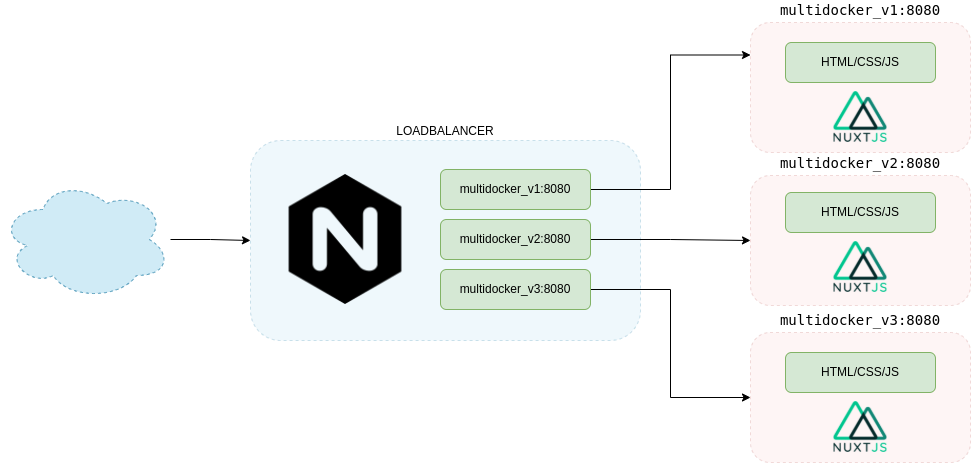

# 6. Desarrollo <!-- omit in TOC -->

# 1. Dockerfile Stages: crear el archivo stage.dockerfile
```vim
### STAGE 1: Build ###
FROM cachac/dockerlabs_base:node14 as build

WORKDIR /usr/src/app

### STAGE 2: NGINX ###
FROM nginx:stable-alpine as release

COPY --from=build /usr/src/app/dist /usr/share/nginx/html

RUN rm /etc/nginx/conf.d/default.conf

COPY nginx/nginx.conf /etc/nginx/conf.d

EXPOSE 8080

CMD ["nginx", "-g", "daemon off;"]
```

> as build = establece el escenario *build*

> as release = establece el escenario *release*

> COPY --from = copia de un stage a otro

> EXPOSE = expone el puerto 8080

> nginx.conf escucha en el puerto 8080

# 2. Construir y ejecutar

## 2.1. Crear la imagen usando el archivo stage.dockerfile (-f) y el nombre dockerlabs
```vim
docker build . -f stage.dockerfile -t dockerlabs

docker images
```

## 2.2. Ejecutar
```vim
docker run -p 8080:8080 dockerlabs:latest
```

> Error Conocido:
>
> listen tcp4 0.0.0.0:8080: bind: address already in use.


## 2.3. Probar página en el browser con ip pública o dominio

## 2.4. Descargar la imagen original node:14.11.0-alpine3.12

```vim
docker pull node:14.11.0-alpine3.12

docker images
```

## 2.5. Comparar tamaño de imagenes NODE

> node14 (usada en el paso anterior): cachac/dockerlabs_base:node14 = ~1.59GB

> Alpine: alpine3.12 = ~114MB

> Comparar el tamaño de la imagen con *stages dockerlabs* y *demowebsite* (lab anterior)


## 2.6. Limpiar imágenes sin utilizar
```vim
docker image prune

docker container prune
```
> Validar las imágenes borradas y la cantidad de espacio reclamada


# 3. Crear cuenta en hub.docker.com y subir imagen
> [Docker Hub](https://docs.docker.com/docker-hub/ )

```vim
docker tag <container_id> <dockerhub user>/dockerlabs

docker tag <container_id> cachac/dockerlabs

docker push <docker user>/dockerlabs
```
Resultado:

> denied: requested access to the resource is denied

## 3.1. Dockerhub  Login y validar en el registry
```vim
docker login
```
> Login Succeeded

# 4. Múltiples contenedores


## 4.1. Crear Red

Para asegurar que todos los contenedores tengan comunicación.

```vim
docker network create lab

docker network ls
```

## 4.2. Crear las imágenes
```vim
docker run --name multidocker_1 -d --network lab dockerlabs
docker run --name multidocker_2 -d --network lab dockerlabs
docker run --name multidocker_3 -d --network lab dockerlabs
```

> En ese caso no especificamos los puertos (-p), por lo que no mapea con un puerto externo.
> Toma los puertos por defecto: 80 externo y 8080 interno (EXPOSE)

## 4.3. Probar en browser


> 502 Bad Gateway


## 4.4. Crear contenedor de balanceo
### 4.4.1. Crear el archivo loadbalancer.dockerfile
```vim
FROM nginx:stable-alpine
WORKDIR /etc/nginx/conf.d
COPY ./dockerfiles_demo/nginx-loadbalancer.conf .
RUN rm /etc/nginx/conf.d/default.conf
RUN mv nginx-loadbalancer.conf default.conf
EXPOSE 80
CMD ["nginx", "-g", "daemon off;"]
```
> COPY = copia el archivo de configuración Nginx Loadbalancer

```vim
docker build . -f loadbalancer.dockerfile -t loadbalancer
```
### 4.4.2. Ejecutar el contenedor de balanceo

Asegurar que estén corriendo los 3 contenedores web
```vim
docker ps
```

```vim
docker run -d --name loadbalancer -dp 8080:80 --network lab loadbalancer

docker ps

docker logs -f loadbalancer
```
> Muestra el puerto mapeado 0.0.0.0:8080->80/tcp

## 4.5. Probar en browser

> Generar tráfico y validar logs

### 4.5.1. Eliminar el contenedor 1 y comprobar balanceo
### 4.5.2. Eliminar el contenedor 2 y comprobar balanceo

> Nota importante: el balanceador no está realizando un health check a los contenedores, por lo que intenta enviar tráfico aunque estén caídos.

## Eliminar contedores en ejecución y detenidos
```
docker rm -f multidocker_3
docker rm -f loadbalancer
```
