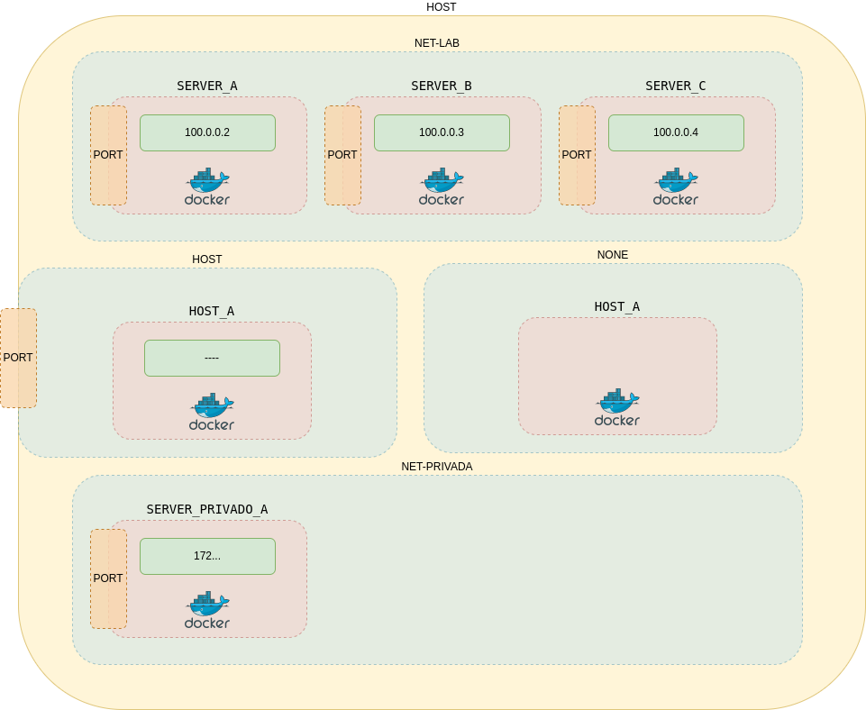

# 07. Networking <!-- omit in TOC -->

# 1. Validar la red en host docker0

> La ip 172.17.0.1/16, funciona como gateway para los contenedores.

```vim
ip a
```
Resultado:
> inet 172.17.0.1/16 brd 172.17.255.255 scope global docker0


## 1.1. Crear red tipo Bridge,

### 1.1.1. Eliminar redes creadas en otros labs
```vim
docker network ls

docker network remove lab
```
### 1.1.2. Agregar el bloque CIDR 100.0.0.0/24.

```vim
docker network create --driver bridge --subnet 100.0.0.0/24 net-lab

docker network ls

docker network inspect net-lab
```

> Validar: driver, subnet


## 1.2. Descargar imagen con herramientas de monitoreo de red
```vim
docker pull wbitt/network-multitool
```

## 1.3. Crear contenedores en la red net-lab y asignar ip estáticas:
```vim
docker run --name server_a --network net-lab -d --ip 100.0.0.2 wbitt/network-multitool
docker run --name server_b --network net-lab -d --ip 100.0.0.3 wbitt/network-multitool
docker run --name server_c --network net-lab -d --ip 100.0.0.4 wbitt/network-multitool
```

# 2. Mostrar la información de server_a:
```vim
docker inspect server_a -f "{{json .NetworkSettings.Networks }}"
```

## 2.1. Instalar jq para mostrar la salida con formato
```vim
sudo apt update && sudo apt-get install -y jq

docker inspect server_a -f "{{json .NetworkSettings.Networks }}" | jq
```

# 3. Probar DNS de network lab:
```vim
docker exec server_a ping server_b
```

# 4. Crear contenedor en red tipo host:
```vim
docker run --name host_a --network host -d wbitt/network-multitool

docker ps -a
```
> Error: bind() to 0.0.0.0:80 failed (98: Address in use)

> El puerto 80 ya está siendo utilizado por el host

## 4.1. Cambiar el puerto de escucha del contenedor

Usando variables:
```vim
docker rm host_a

docker run -d -e HTTP_PORT=1180 -e HTTPS_PORT=11443 --name host_a --network host wbitt/network-multitool

docker ps

docker inspect host_a -f "{{json .NetworkSettings.Networks }}" | jq
```
> Está corriendo pero *NO* tiene una ip propia

## 4.2. Comprobamos que la red del contenedor es la misma del host:

```vim
docker exec host_a ip a
```

# 5. Crear una nueva red net-privada y correr un contenedor

```vim
docker network create net-privada
```

# 6. Probar que el nuevo contenedor está aislado de net-lab
```vim
docker run -d --name server_privado_a --network net-privada wbitt/network-multitool

docker inspect server_privado_a -f "{{json .NetworkSettings.Networks }}" | jq

ping <'ip_server_privado_a'>

docker exec server_a ping server_privado_a
```

> Hay comunicación entre el host y la red net-privada

> No hay comunicación entre contenedores

# 7. Crear un nuevo contenedor sin red:
```vim
docker run --name host_b --network none -d wbitt/network-multitool

docker inspect host_b -f "{{json .NetworkSettings.Networks }}" | jq

docker exec host_b ip a
```
> No tiene salida porque no tiene red

# El diagrama final quedaría así:



# Limpieza
```vim
docker rm -f $(docker ps -a -f status=running -q)

docker image prune
```
> [Tips para eliminar](https://www.digitalocean.com/community/tutorials/how-to-remove-docker-images-containers-and-volumes)

